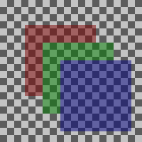

# Cobalt Clients Performance Guide

This document contains a list of hints and tricks for using web technologies
that when employed will result in improved performance of Cobalt client apps.

[TOC]

### Avoid large opacity animations of DOM subtrees.

Be careful when applying the CSS opacity property to DOM subtrees.  When
applying opacity to a DOM leaf node, the renderer can usually easily render the
single element the way it normally would, except with an opacity parameter set.
When rendering a non-trivial multi-subnode DOM subtree though, in order for
the results to appear correct, the renderer has no choice but to create an
offscreen surface, render to that surface *without* opacity, and then finally
render the offscreen surface onto the onscreen surface *with* the set opacity
applied.

For example, when following this method on a subtree of 3 cascading rectangles,
the results will look like this:

For comparison, this is what it would look like if the opacity was applied
individually to each leaf node:

The problem in the first case where opacity is applied to the subtree is that
switching render targets to and from an offscreen surface is time consuming
for both the CPU and GPU, and can on some platforms noticeably slow down
performance, likely manifesting as a lower framerate in animations.  While it is
possible that Cobalt may cache the result, it is not guaranteed, and may not be
possible if the subtree is being animated.  Additionally, the offscreen surface
will of course consume memory that wouldn't have been required otherwise.

#### Similar situations

While opacity tends to be the most common instigator of the behavior described
above, there are other situations that can trigger offscreen surface usage.
They are:

 - Setting `overflow: hidden` on a rotated subtree parent element (e.g. via
   `transform: rotate(...)`)
 - Setting `overflow: hideen` on a subtree parent element with rounded corners.

### Explicitly set Image `src` attributes to `''` when finished with them.

Cobalt maintains an image cache with a preset capacity (e.g. default of 32MB on
platforms with 1080p UIs, but it can be customized).  When an image goes out
of scope and is no longer needed, instead of leaving it up to the garbage
collector to decide when an image should be destroyed and its resources
released, it is recommended that Image objects have their `src` attribute
explicitly cleared (i.e. set to `''`) when they are no longer needed, so
that Cobalt can reclaim the image resources as soon as possible.
