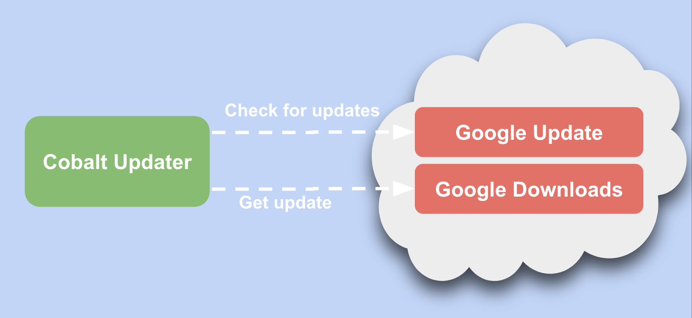
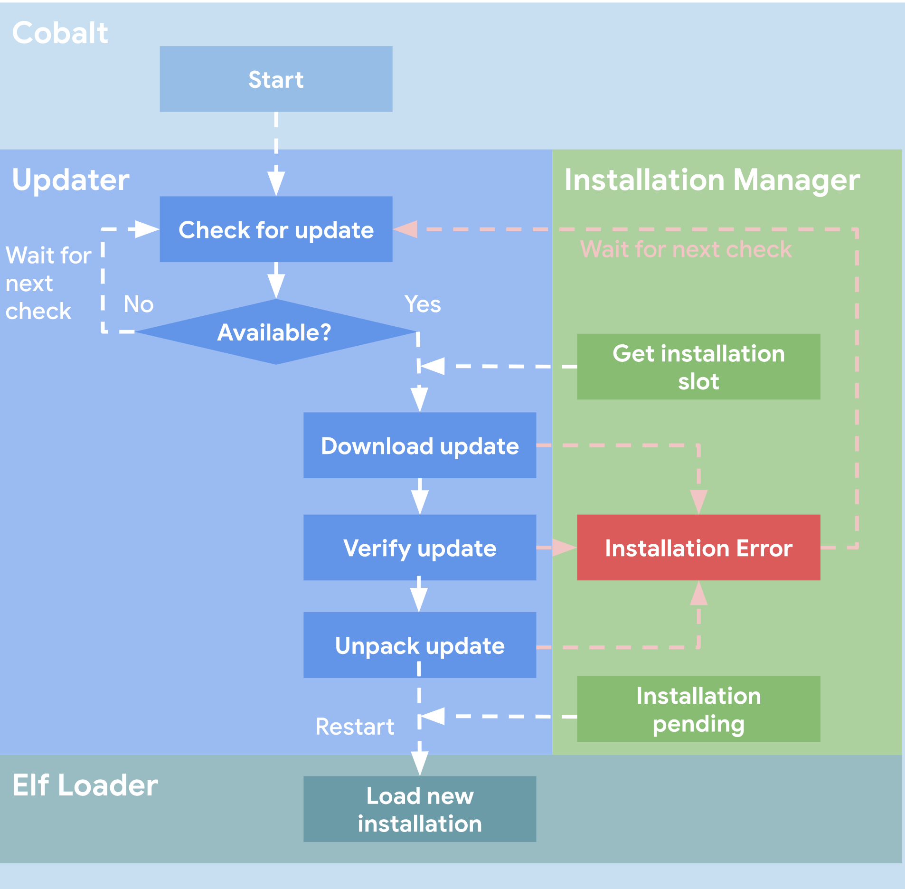

# Cobalt Update Framework

## Background

The updatability of Cobalt on the field devices enables the deployment of new features and crucial bug fixes in a timely manner. It significantly reduces the amount of work on partners’ shoulders to update to a newer version of Cobalt. This document introduces how Cobalt updates itself and what the system is like that supports the update of Cobalt. Note that the Cobalt Update Framework is currently used only for Evergreen configurations. 

## Goal

*   Enable Cobalt to automatically update itself periodically
*   Build a framework that hosts and serves the updates reliably

## Overview

The Cobalt Updater is a module of Cobalt. It is initiated as Cobalt starts. It periodically sends requests to Google Update server to check for updates. If an update is available, the Update server responds with a downloadable link of the update package to the Updater. Then the Updater connects to the link, which is hosted on Google Downloads server, to download the update package. If an update is not available, the Updater server responds to indicate no update. Then the Updater waits until the next scheduled time to check for updates again.

## Implementation

### Google Update

Google Update is an update service that manages updates for Google products serving billions of users worldwide. We set up Cobalt updates on Google Update in a way that each type of device gets a unique update link (URL). The device type is identified by [Starboard ABI](https://***REMOVED***/a/google.com/open?id=1r1vS_FFMV9F-YlNaudxFwhAVG7delVleKfYgLLRUn3o) (SABI) string. For instance, Raspberry Pi 2 and Linux desktop are two different types of devices. They are identified by two different SABI strings, and get two different update URLs on Google Update. The request sent by the Cobalt updater to Google Update  contains a SABI string. Google Update finds the suitable update link that matches the SABI string from the request, and responds to the Cobalt updater.

Google Update allows the setup of multiple channels. We set up different channels for internal testing, partner testing, production and developers. 

Google Update also allows staged rollout and rollback when things go wrong. In the case where a problem is detected that requires rollback or fixes, Google will work with the partner to find a path to resolution.

### Google Downloads

Google Downloads is a download hosting service for official Google content. We generate Cobalt update packages for various types of devices, and upload the packages to Google Downloads. Then the links to the packages on Google Downloads are served on Google Update.

### Cobalt Updater

The updater checks for updates on Google Downloads, then downloads the update package if available. After the download is complete, the updater verifies the downloaded package, then unpack the package to a designated installation location. The updater runs update checks following a predefined schedule: the first check happens after Cobalt starts; the second check runs in a randomized number of hours between 1 and 24 hours; the following checks run every 24 hours.

### Update flow

Above is a chart of the workflow of a complete update cycle. It shows how the Updater operates step by step and how it interacts with the Installation Manager and the Elf Loader[^1].

The Installation Manager maintains the installation slots and provides a proper slot to the Updater. During the update and installation process, the Installation Manager keeps track of the status and collects any installation error. After the installation is completed, the Installation Manager marks the installation as pending, so that next time Cobalt starts, the Elf Loader loads the new installation and the update is complete. If the target platform supports app exits/suspends on user exiting, Cobalt will exit when an installation is pending, so that the new update will be picked up on the next start; otherwise, Cobalt is not able to exit by itself, then a manual termination of the app is required to pick up the update on restart.  

## FAQ

### What happens if an urgent problem is found that requires a rollback or update?

In the case where a problem is detected that requires rollback or fixes, Google will work with the partner to find a path to resolution.

<!-- Footnotes themselves at the bottom. -->
## Footnotes

[^1]:
     Elf loader - A portable loader that loads the Cobalt binary and resolves symbols with Starboard API when Cobalt starts up in Evergreen mode.